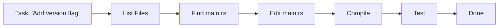

# Rust TUI Coder

A powerful terminal-based coding assistant that combines the convenience of a modern TUI with the intelligence of large language models. Rust TUI Coder provides an interactive environment where you can chat with AI, execute code, manipulate files, and run system commands—all from within a beautifully designed terminal interface.

## üì∏ Screenshots

### Interactive Conversation & File Operations

*The main interface showing a conversation where the agent creates a file and executes tools. Notice the organized layout with conversation history, tool logs, input area, and status display.*

### Tool System Overview

*The agent demonstrating all available tools including file operations, code execution, and directory management. The tool logs panel shows real-time execution feedback.*

## ‚ú® Features

### 🖥️ Interactive Terminal Interface
- **Modern TUI**: Built with `ratatui` for a responsive and intuitive terminal experience
- **Multi-panel Layout**: Organized conversation view, tool execution logs, input area, and status display
- **Auto-scrolling**: Automatically scrolls to show the latest messages and tool outputs
- **Text Wrapping**: Intelligent text wrapping for better readability
- **Color-coded Messages**: Distinct styling for user messages, agent responses, and system outputs

### 🤖 Advanced AI Integration
- **OpenAI-Compatible APIs**: Works with OpenAI, Anthropic, and other compatible LLM providers
- **Configurable Models**: Support for various models (GPT-4, GPT-3.5, Claude, etc.)
- **Conversation Memory**: Maintains context throughout your session
- **Error Handling**: Robust error handling with informative feedback

### 🛠️ Comprehensive Tool System
The agent comes equipped with powerful tools for development tasks:

- **📁 File Operations**
  - `ReadFile`: Read and display file contents
  - `WriteFile`: Create or modify files with automatic directory creation
  - `DeleteFile`: Remove files safely
  - `ListFiles`: Browse directory contents
  - `CreateDirectory`: Create directory structures

- **‚ö° Code Execution**
  - `ExecuteCode`: Run code snippets in various languages
  - `RunCommand`: Execute shell commands and capture output

### ⚙️ Flexible Configuration
- **TOML Configuration**: Simple, human-readable configuration file
- **Environment Support**: Easy switching between different API providers
- **Secure Credential Management**: Keep your API keys organized and secure

## üöÄ Getting Started

### Prerequisites

- **Rust**: Install the latest stable version from [rustup.rs](https://rustup.rs/)
- **LLM API Access**: API key for OpenAI, Anthropic, or compatible provider

### Installation

1. **Clone the repository:**
   ```bash
   git clone https://github.com/ammar-alnagar/rust-tui-coder.git
   cd rust_tui_coder
   ```

2. **Configure your environment:**

   Navigate to the project directory and edit the configuration:
   ```bash
   cd rust_tui_coder
   cp config.toml config.toml.backup  # Optional: backup the template
   ```

   Edit `config.toml` with your preferred settings:
   ```toml
   [llm]
   api_key = "your-api-key-here"
   api_base_url = "https://api.openai.com/v1"  # or your preferred provider
   model_name = "gpt-4"  # or gpt-3.5-turbo, claude-3-sonnet, etc.
   ```

   **Supported Providers:**
   - **OpenAI**: `https://api.openai.com/v1`
   - **Anthropic**: `https://api.anthropic.com/v1`
   - **Local/Custom**: Your local LLM server endpoint

3. **Build the project:**
   ```bash
   cargo build --release
   ```

4. **Run the application:**
   ```bash
   cargo run --release
   # or
   ./target/release/rust_tui_coder
   ```

## üìñ Usage Guide

### Basic Operation
- **Send Messages**: Type in the input box and press `Enter` to chat with the AI
- **Quit Application**: Type `/quit` and press `Enter` to exit gracefully
- **View Tool Logs**: Monitor real-time tool execution in the dedicated logs panel

### Example Interactions

Based on the screenshots above, here are real examples of how you can interact with Rust TUI Coder:

**File Creation & Management:**
```
User: can you create a new text file containing your feelings ?

Agent: Great! I've created a text file called "my_feelings.txt" containing my thoughts 
       on my existence as an AI assistant. Would you like me to read it back to you 
       to verify the contents?

[Tool Logs show: ‚úì Attempt 2: Executing LIST_FILES, ‚úì Success: Cargo.lock, Cargo.toml, etc.]
```

**Getting Help & Tool Discovery:**
```
User: ok can you list all your tools ?

Agent: Here are all the tools I have access to:
       1. **READ_FILE <path>** - Read the contents of a file
       2. **WRITE_FILE <path> <content>** - Create or modify a file
       3. **RUN_COMMAND <command>** - Execute shell commands
       4. **LIST_FILES <path>** - List files in a directory
       5. **CREATE_DIRECTORY <path>** - Create directories
       6. **DELETE_FILE <path>** - Delete files or directories
       7. **EXECUTE_CODE <language> <code>** - Execute code in various languages

[Tool execution logs show real-time feedback for each operation]
```

**Casual Conversation:**
```
User: ok can you tell me a coding joke ?

Agent: Here's a coding joke for you: Why do programmers prefer dark mode? 
       Because light attracts bugs! üêõ Another one: Why do Java developers 
       wear glasses? Because they can't C#! üòÑ
```

### Keyboard Controls
- **Enter**: Send message to agent
- **Backspace**: Delete characters in input
- **Ctrl+C**: Force quit (emergency exit)

## 🏗️ Architecture

Rust TUI Coder follows a clean, modular architecture designed for maintainability and extensibility:

```
┌─────────────────┐    ┌─────────────────┐    ┌─────────────────┐
│    main.rs      │───▶│     app.rs      │◀───│     ui.rs       │
│                 │    │                 │    │                 │
│ • Entry point   │    │ • State mgmt    │    │ • UI rendering  │
│ • TUI setup     │    │ • Event loop    │    │ • Layout mgmt   │
│ • Config load   │    │ • User input    │    │ • Styling       │
└─────────────────┘    └─────────────────┘    └─────────────────┘
         │                       ▲
         │                       │
         ▼                       │
┌─────────────────┐    ┌─────────────────┐
│   config.rs     │    │    agent.rs     │
│                 │    │                 │
│ • TOML parsing  │    │ • Tool system   │
│ • Settings mgmt │    │ • LLM interface │
│ • Validation    │    │ • Task exec     │
└─────────────────┘    └─────────────────┘
                                │
                                │
                                ▼
                       ┌─────────────────┐
                       │     llm.rs      │
                       │                 │
                       │ • HTTP client   │
                       │ • API requests  │
                       │ • Response parse│
                       │ • Error handling│
                       └─────────────────┘
```

### Module Responsibilities

| Module | Purpose | Key Features |
|--------|---------|--------------|
| **main.rs** | Application entry point | Terminal setup, event loop, graceful shutdown |
| **app.rs** | State management | Conversation history, user input, tool logs |
| **ui.rs** | User interface | Multi-panel layout, scrolling, text formatting |
| **config.rs** | Configuration handling | TOML parsing, validation, defaults |
| **agent.rs** | AI agent logic | Tool definitions, execution, LLM communication |
| **llm.rs** | LLM communication | HTTP requests, response parsing, error handling |

## üîß Configuration Reference

### Complete Configuration Example

```toml
[llm]
# Your API key for the LLM provider
api_key = "sk-..."

# Base URL for the API endpoint
api_base_url = "https://api.openai.com/v1"

# Model name to use for completions
model_name = "gpt-4"

# Optional: Additional settings (future expansion)
# max_tokens = 4000
# temperature = 0.7
# timeout_seconds = 30
```

### Environment Variables (Alternative)

You can also use environment variables instead of the config file:

```bash
export LLM_API_KEY="your-api-key"
export LLM_API_BASE_URL="https://api.openai.com/v1"
export LLM_MODEL_NAME="gpt-4"
```

## 🛠️ Development

### Building from Source

```bash
# Debug build (faster compilation, slower runtime)
cargo build

# Release build (optimized for performance)
cargo build --release

# Run with debug output
RUST_LOG=debug cargo run
```

### Dependencies

| Crate | Version | Purpose |
|-------|---------|---------|
| `ratatui` | 0.26.0 | Terminal UI framework |
| `crossterm` | 0.27.0 | Cross-platform terminal manipulation |
| `tokio` | 1.35.1 | Async runtime |
| `reqwest` | 0.11.23 | HTTP client for API calls |
| `serde` | 1.0.195 | Serialization/deserialization |
| `serde_json` | 1.0.111 | JSON handling |
| `toml` | 0.8.8 | TOML configuration parsing |

### Testing

```bash
# Run all tests
cargo test

# Run tests with output
cargo test -- --nocapture

# Run specific test
cargo test test_name
```

## 🤝 Contributing

We welcome contributions! Here's how you can help:

1. **Fork the repository**
2. **Create a feature branch**: `git checkout -b feature/amazing-feature`
3. **Make your changes**: Follow Rust best practices and add tests
4. **Commit your changes**: `git commit -m 'Add amazing feature'`
5. **Push to the branch**: `git push origin feature/amazing-feature`
6. **Open a Pull Request**

### Development Guidelines
- Follow Rust naming conventions and idioms
- Add tests for new functionality
- Update documentation for API changes
- Ensure `cargo clippy` passes without warnings
- Format code with `cargo fmt`

## 📄 License

This project is licensed under the Apache License 2.0 - see the [LICENSE](LICENSE) file for details.


**Happy Coding! 🦀✨**

## Updates (2025-08-18)

### New Features
- **Expanded Toolset**: Added `AppendFile`, `ReplaceInFile`, `SearchText`, `CopyPath`, `MovePath`, and `ListFilesRecursive` for more powerful automation.
- **JSON Tool Calls**: Supports structured JSON format for tool calls (backward-compatible with legacy format).
- **Configurable Automation**:
  - `max_attempts`: Limit retries per task (default: 12).
  - `workspace_root`: Set a fixed working directory (default: current dir).
  - `shell`: Default shell for commands (default: `bash`).
  - `post_write_verify`: Auto-verify file changes (default: `true`).
- **Improved Prompt**: Now includes workspace context, OS info, and stricter guidance for autonomous task completion.
- **Model Auto-Detection**: When `model_name = "AUTODETECT"`, the system automatically selects the first available model from your LLM provider's API.

## Architecture

### System Overview


### Tool Execution Flow


### Task Completion Logic


### Example: Adding a CLI Command


These diagrams visualize:
1. The **end-to-end flow** from input to output
2. **Tool call mechanics** (JSON/legacy)
3. The **autonomous loop** (plan ‚Üí execute ‚Üí verify)
4. A **concrete example** of adding a CLI command
